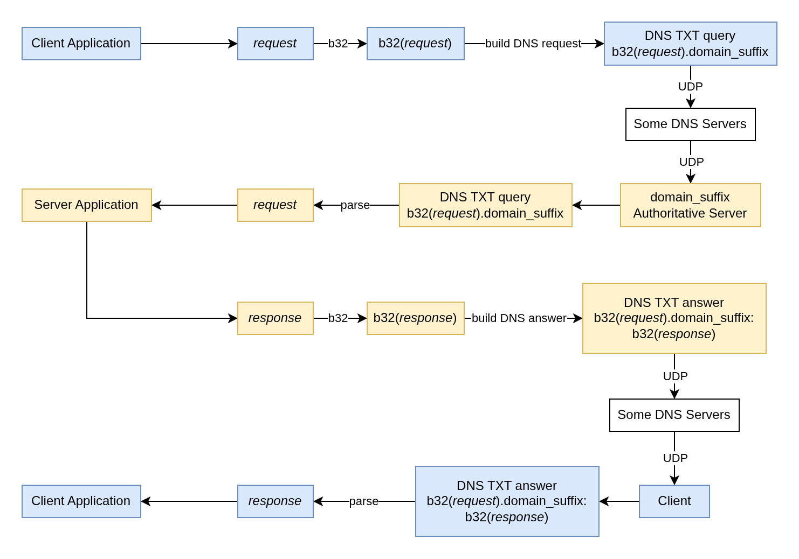

# Technical Notes

## Phase 1

In Phase 1, `short_communication` supports request and response that can fit into a single DNS packet after base32 encoding. There's no fragmentation, assembly, encryption, authentication, or reliability mechanism implemented in this phase.

Messages are encoded in base32, and are included in subdomain labels for requests, and in TXT records for responses.
