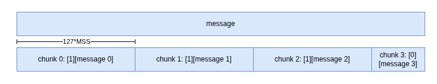
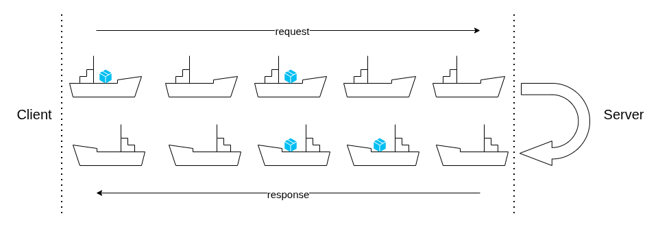

# Technical Notes

## Phase 1

In Phase 1, `short_communication` supports request and response that can fit into a single DNS packet after base32 encoding. There's no fragmentation, assembly, encryption, authentication, or reliability mechanism implemented in this phase.

Messages are encoded in base32, and are included in subdomain labels for requests, and in TXT records for responses.

## Phase 2

### Reliable Long Message Transmission through KCP

KCP is an alternative to TCP, designed for low-latency and high-throughput communication over unreliable networks. It provides features like fragmentation, assembly, retransmission, and congestion control.

The crate [kcp](https://crates.io/crates/kcp) provides core KCP functionalities. Specifically, it provides a `message` semantics where messages are delivered atomically (in full or not at all) and in order. It allows decoupling of the underlying transport protocol, enables us to use a DNS tunnel to transmit its packets.

For more details, see the [kcp crate documentation](https://docs.rs/kcp/latest/kcp/struct.Kcp.html).

However, its implementation has a hardcoded message size limit of 127 * MSS. In the context of DNS tunneling, the MTU is typically around 150 bytes, which results in a MSS of around 120 bytes, meaning the maximum message size is around 15 KB. This is insufficient.

My solution is to break a long message into 127*MSS chunks, and view each chunks as a "message" in KCP's perspective. Each chunk is prefixed with a single byte, 1 if more chunks follow, 0 for the final chunk.

Since KCP guarantees in-order delivery, the receiver can simply read chunks until it encounters a chunk with the bit 0, and then reassemble the original message. This way, I can support messages of arbitrary size.

### The Challenge of Asymmetric Packet Flow

DNS is fundamentally a request-response protocol: a client sends a single packet of query and receives a single packet of response. In phase 1, this isn't a problem since each request maps to exactly one response. However, in phase 2, and in real-world applications, the number of request packets and response packets often don't match.

For example, if the application uploads a large file, the client sends many request packets while the server only needs a few responses. Conversely, when downloading a large file, the client sends few requests but the server sends many responses, which is even more challenging because the server cannot actively send more packets.

An ARQ protocol like KCP cannot solve this problem because the limitation is on the number of packets both sides can send.

To solve it, there must be a consistent flow of packets between the client and the server, even if one side has nothing meaningful to send.

Think of them as continuous flow of ships making a round trip from client to server and back. Sometimes the ship carries cargo (some meaningful data), and sometimes it is empty (a NOOP message).

A NOOP message is defined so that the receiving side knows such message don't carry meaningful data, and are there because the other side thinks the receiving side side might want to send more data.

For client:

- If it has a packet to send, it sends the packet.
- If it has no packet to send but the NOOP interval is reached, it sends 1 NOOP.
- If it receives a meaningful packet, it sends 1 NOOP to allow the server to send more packets if it has.

For server (who can only, and must send a response for each request):

- If it has a packet to send, it sends the packet.
- If it has no packet to send, it sends 1 NOOP.

This mechanism essentially creates a continuous flow of dynamically sized fleet of ships between the client and the server. The fleet size goes up when either side has more packets to send, and goes down when both side have no packet to send.
