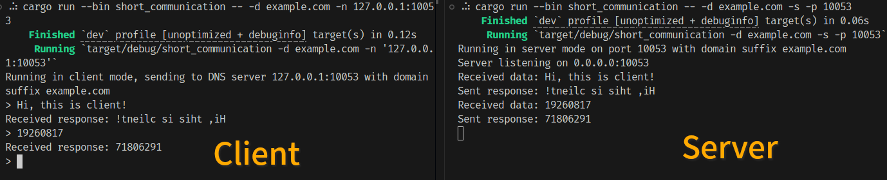
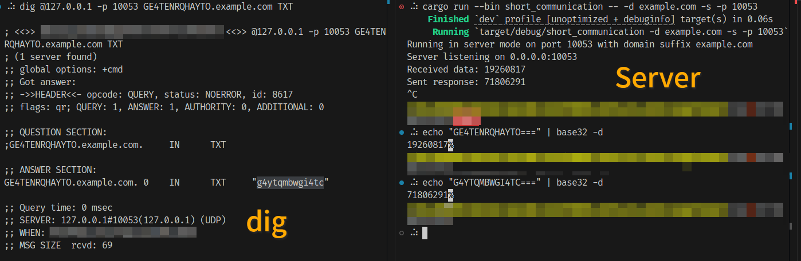
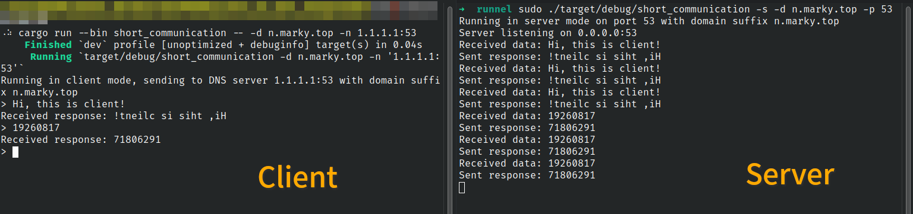
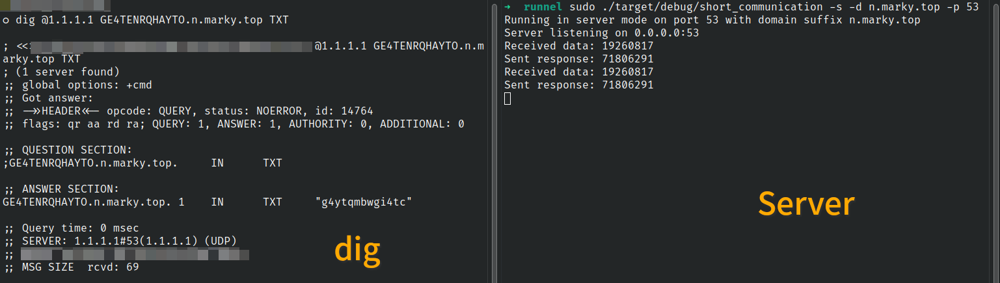
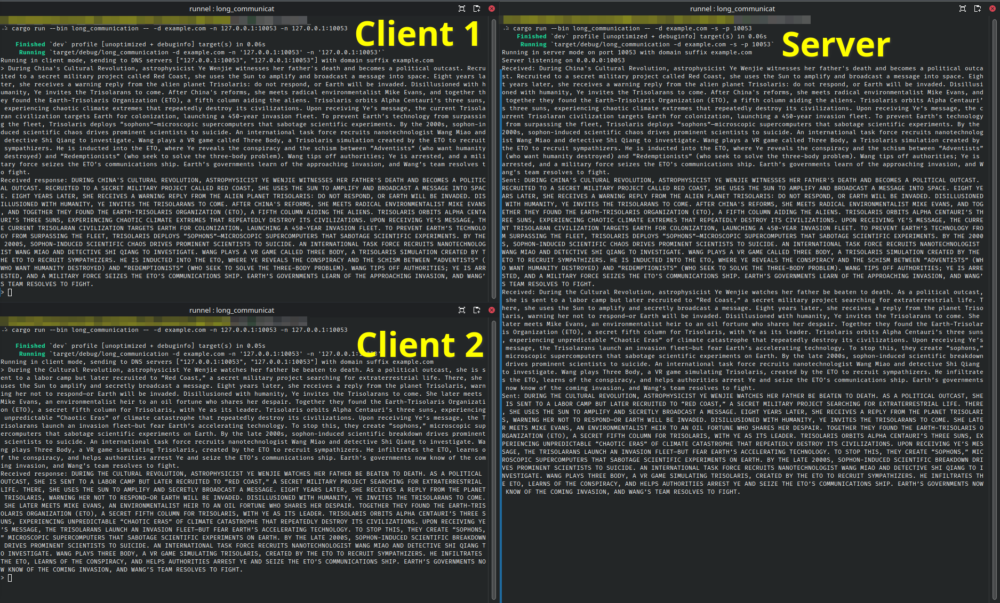
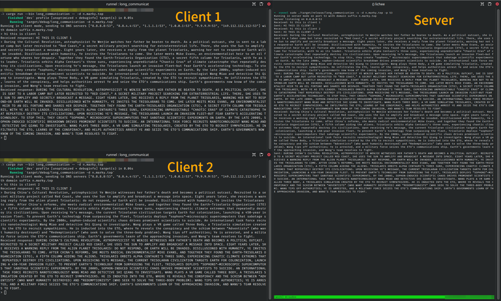

# runnel - DNS Tunnel in Rust

## Overview

- Disclaimer
- What is runnel and why you might be interested in it?
- Phase 1: Short Communication through DNS Tunnel
- **Phase 2: Long Communication through DNS Tunnel (the fun part)**

## Disclaimer

This project is for educational purposes only. It is not intended to be used for any malicious activities, such as bypassing network restrictions without permission. Always ensure that you have the necessary permissions before using or deploying any tools that can bypass network restrictions.

## What is runnel and why you might be interested in it?

`runnel` is a DNS tunnel implemented in Rust. A DNS tunnel is a technique that allows data to be transmitted over DNS queries and responses. Unlike other protocols such as HTTP or HTTPS, DNS traffic is often allowed through firewalls and network filters. Also, the destination of DNS queries is some public DNS server whose IP is on white list with high probability. These features make DNS tunnels **a powerful tool for bypassing network restrictions**.

For example, Oct 2025, Ramsay Leung posted in his blog [A Story About Bypassing Air Canada's In-flight Network Restrictions](https://ramsayleung.github.io/en/post/2025/a_story_about_bypassing_air_canadas_in-flight_network_restrictions/) that he successfully got free WiFi on Air Canada flights by tunneling his internet traffic through DNS queries and responses.

For more implementation details about this project, please refer to the [Technical Notes](./DEVELOPERS.md).

For more guidance on how to use this project, either as a binary or as a library, please refer to the following sections.

## Phase 1: Short Communication through DNS Tunnel

In this phase, a binary, `short_communication`,is implemented to enable short communication through a DNS tunnel. `short` is defined as messages that can fit into a single DNS packet, whose limit (depending on domain suffix) is around 150 bytes for request and response.

### Usage

A help message is provided for `short_communication`:

```bash
cargo run --bin short_communication -- -h
```

#### Server Mode

To run it in server mode, provide the `-s` flag, the domain suffix, and optionally specify the port to listen on (default is 5353):

```bash
cargo run --bin short_communication -- -s -d example.com -p 10053
```

#### Client Mode

To run it in client mode, provide the domain suffix and the DNS server address (the DNS server that the client will query, which can be a public DNS server or the server you just started locally in server mode):

```bash
cargo run --bin short_communication -- -d example.com --dns 127.0.0.1:10053
```

### Local Demonstration

This binary allows user to input messages in the client terminal, which will be sent to the server through DNS tunnel.

As a demonstration, the server responds with the reversed message received from the client.



You may also verify using `dig` command that the server receives the request and responds correctly (`19260817` encodes to base32 `GE4TENRQHAYTO` and `g4ytqmbwgi4tc` decodes to `71806291`):

```bash
dig @127.0.0.1 -p 10053 GE4TENRQHAYTO.example.com TXT
```



### Actually Deploying Server to be an Authoritative DNS Server

To make it more than a local toy, you might want to deploy the server to a publicly accessible machine, let it listen to port 53, and point a domain's NS record to it. This way, you can use the client from anywhere in the world **using public DNS servers** (which also makes it possible to concurrently querying multiple public DNS servers to speed things up/avoid rate limiting) to communicate with our server.

Run a DNS server on port 53 usually requires root privileges, so you might want to use `sudo` to run the server:

```bash
sudo ./target/debug/short_communication -s -d n.marky.top -p 53
```

Run the client with Cloudflare's public DNS server:

```bash
cargo run --bin short_communication -- -d n.marky.top -n 1.1.1.1:53
```



Or use `dig`:

```bash
dig @1.1.1.1 GE4TENRQHAYTO.n.marky.top TXT
```



## Phase 2: Long Communication through DNS Tunnel

In this phase, a binary, `long_communication`, is implemented to enable long communication through a DNS tunnel. `long` means messages of any length that can be transmitted in a reliable, ordered way.

A module `runnel_session` is implemented to allow application developments on top of the DNS tunnel.

### The Binary

#### Usage

A help message is provided for `long_communication`:

```bash
cargo run --bin long_communication -- -h
```

##### Server Mode

To run it in server mode, provide the `-s` flag, the domain suffix, and optionally specify the port to listen on (default is 5353):

```bash
cargo run --bin long_communication -- -s -d example.com -p 10053
```

##### Client Mode

To run it in client mode, provide the domain suffix and the DNS server address (the DNS server that the client will query, which can be a public DNS server or the server you just started locally in server mode):

```bash
cargo run --bin long_communication -- -d example.com -n 127.0.0.1:10053 -n 127.0.0.1:10053
```

Different from `short_communication`, `long_communication` allows user to specify multiple DNS servers in client mode, which can speed up the communication and also avoid potential rate limiting.

***Caveat:*** Linux has a hardcoded, 4096-char (4095 excluding newline) limit for terminal line when operating in canonical mode (which is the default) ([the source code](https://github.com/torvalds/linux/blob/v5.11/drivers/tty/n_tty.c#L1681)). This means that if you input a message longer than 4096 chars in the client terminal, it will be truncated by the terminal before being sent to the client. To bypass this limit, you can switch the terminal to non-canonical mode using `stty -icanon` command.

```bash
stty -icanon && cargo run --bin long_communication -- -d example.com -n 127.0.0.1:10053
```

#### Local Demonstration

As a demonstration, the server responds with the capitalized message received from the client.



As you can see, two clients are talking to the server at the same time.

#### Actually Deploying Server to be an Authoritative DNS Server

Similar to phase 1, you can deploy the server to be an actual authoritative DNS server for some domain.



As you can see, client requests are load balanced to use multiple public DNS servers.

If you just want to test and make sure it works, you can redirect a file as input:

```bash
cat README.md | cargo run --bin long_communication -- -d n.marky.top
```

or input whatever you want (be aware of the caveat mentioned above about terminal line limit):

```bash
cargo run --bin long_communication -- -d n.marky.top
```

I will try my best to keep the authoritative server of `n.marky.top` running so you can also play with it. However, it runs on a [RISC-V dev board](https://wiki.sipeed.com/hardware/en/lichee/RV_Nano/1_intro.html) (256MB RAM, 1GHz single core CPU) and freezes from time to time. Not the most stable server. You can visit [https://runnelhealth.marky.top/](https://runnelhealth.marky.top/) to check the health status of the server.

### The Library

#### Usage

The `runnel_session` module provides **ordered, reliable, message-based** transmission over a DNS tunnel. Message boundaries are preserved: each `send` corresponds to exactly one `recv`.

##### Client

```rust
let mut client = RunnelClient::new(
    vec!["8.8.8.8:53".to_string()],
    "tunnel.example.com",
).await?;

client.send(b"hello")?;
let reply: Option<Vec<u8>> = client.recv();
```

##### Server

```rust
let server = RunnelServer::new("0.0.0.0:53", "tunnel.example.com").await?;

for conv in server.active_convs() {
    if let Some(msg) = server.recv(conv) {
        server.send(conv, b"reply")?;
    }
}
```

Each client session is identified by a `u32` conversation ID. The server multiplexes many clients over a single listening socket, each with its own ordered message stream. Retransmission, sequencing, and fragmentation are handled transparently by the underlying KCP protocol. See `long_communication.rs` for a working example of the full client-server exchange.

## For Developers of `runnel`

[Technical Notes](./DEVELOPERS.md)

## For 98-008 Teaching Group

[Check points and requirements checklist](./for_98-008_teaching_group.md)
